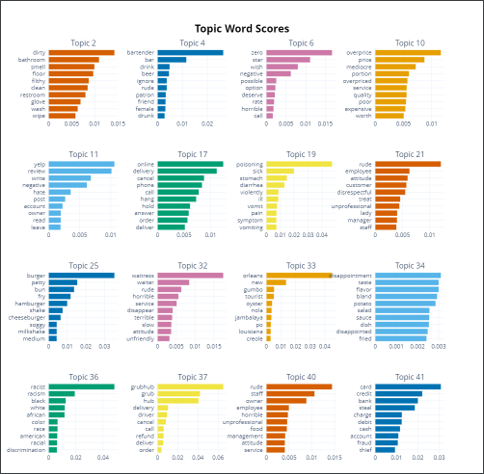
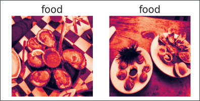

# Yelp Review Text and Photo Analysis

In this project, I perform image classification for images of Yelp reviews as well as
the identification of topics of dissatisfaction. 

The dataset used is the [Yelp Dataset](https://www.yelp.com/dataset).

This image classification model uses transfer learning with Google's MobileNetV2 model
to identify different classes of pictures.

The topic identification part of the project uses the Bertopic package.

The final part of the project is to use the Yelp API to update our topic identification
model.

## Useful Links

* [Project presentation (Powerpoint)](Project_Presentation.pptx)
* Jupyter Notebook([ipynb format](Notebook.ipynb) / [HTML format](Notebook_HTML.html))

## Screenshots

### Topic Identification

### Image preprocessing

#### Before equalization

#### After equalization

## Libraries / Packages Used

* [Tensorflow - Keras](https://www.tensorflow.org/)
* [Scikit-Learn](https://scikit-learn.org/)
* [BERTopic](https://github.com/MaartenGr/BERTopic)
* [HDBScan](https://hdbscan.readthedocs.io/en/latest/how_hdbscan_works.html)
* [Spacy](https://spacy.io/)
* [Vader Sentiment](https://github.com/cjhutto/vaderSentiment)
* [Scikit-Image](https://scikit-image.org/)
* [Open CV](https://opencv.org/)
* [Category Encoders](https://contrib.scikit-learn.org/category_encoders/)
* [UMAP-learn](https://umap-learn.readthedocs.io/en/latest/)
* [Plotly-python](https://plotly.com/python/)
* Matplotlib / Seaborn
* Pandas / Numpy 

## Developed By

Octave Antoni

[Connect with me on Linkedin](https://www.linkedin.com/in/octave-antoni/)

## License

    Copyright 2023 Octave Antoni

    Licensed under the Apache License, Version 2.0 (the "License");
    you may not use this file except in compliance with the License.
    You may obtain a copy of the License at

        http://www.apache.org/licenses/LICENSE-2.0

    Unless required by applicable law or agreed to in writing, software
    distributed under the License is distributed on an "AS IS" BASIS,
    WITHOUT WARRANTIES OR CONDITIONS OF ANY KIND, either express or implied.
    See the License for the specific language governing permissions and
    limitations under the License.